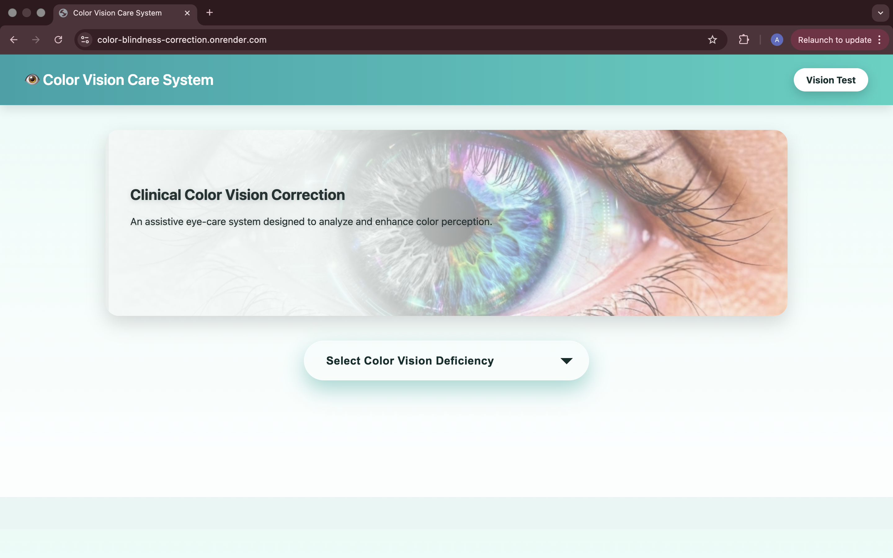
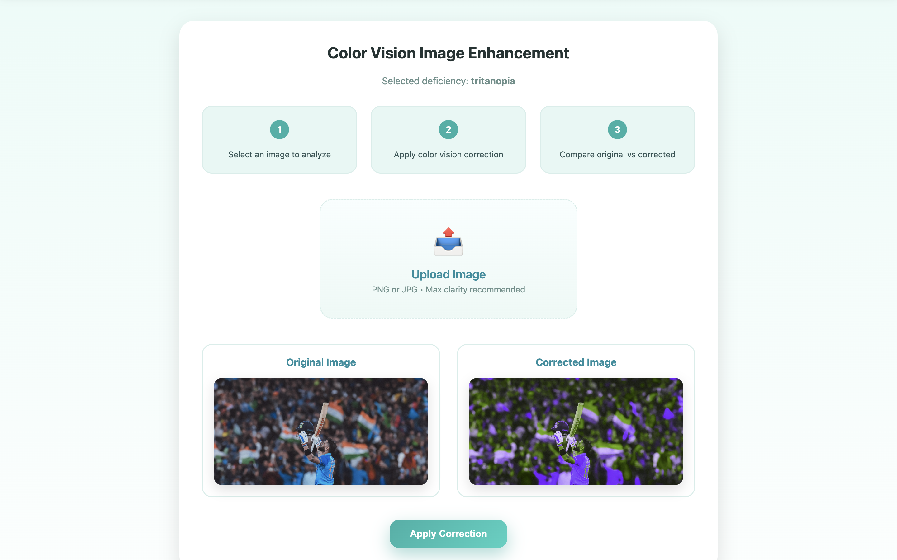
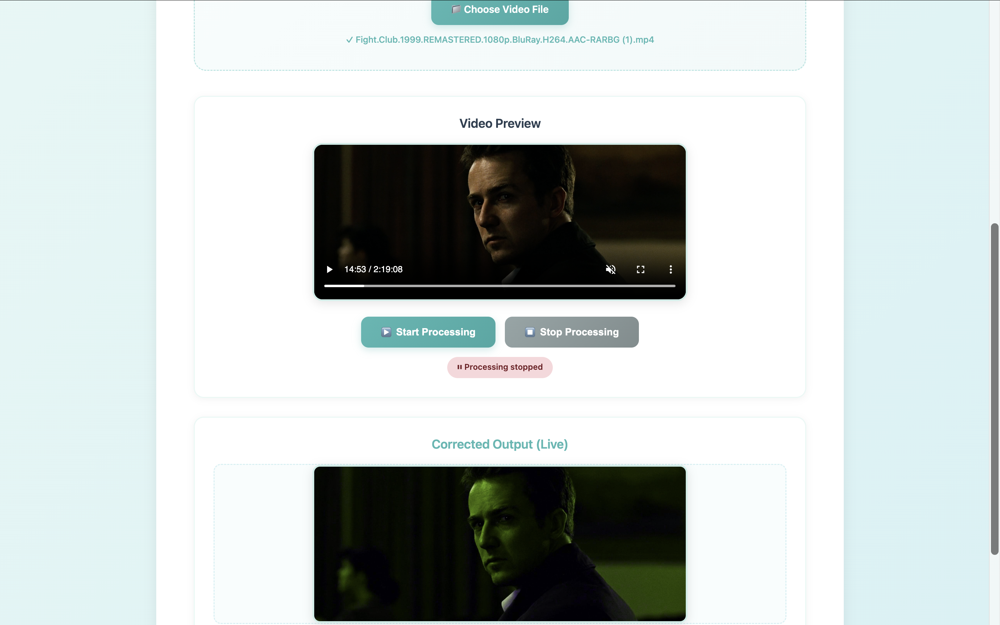
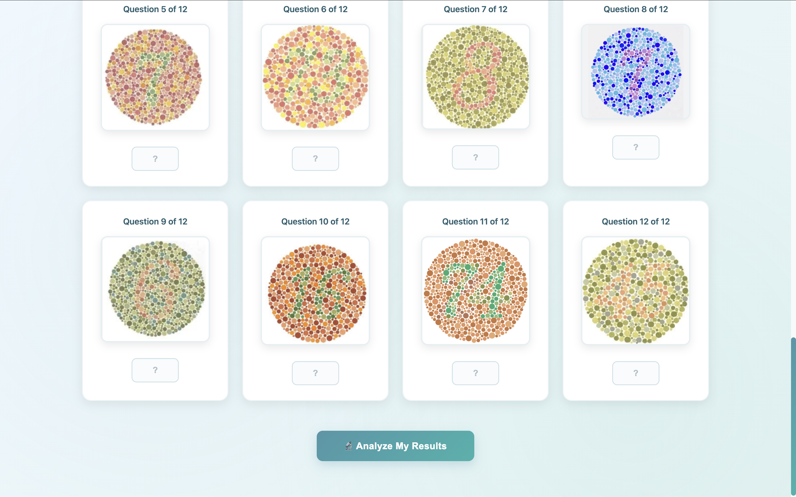

Color Vision Care System

Overview

Color Vision Care System is a web-based assistive application designed
to simulate and enhance color perception for individuals with color
vision deficiency.

The system allows users to analyze how different types of color
blindness affect visual perception and apply corrective transformations
to improve color distinguishability.

This project extends an LMS transformation-based simulation approach
into a structured, interactive web application with enhanced UI and
production-ready deployment.

Features

-   Simulation of:
    -   Protanopia
    -   Deuteranopia
    -   Tritanopia
    -   Hybrid 
-   Color correction using LMS transformation matrices
-   Image upload and processing
-   Live camera-based color correction
-   Video correction support
-   Clean clinical-style UI
-   Production deployment configuration

System Architecture

Processing pipeline:
1. Convert image from RGB to LMS color space.</n>
2.Apply transformation matrix to simulate selected color vision
deficiency.</n>
3. Apply correction matrix (if enabled) to enhance color
distinction.</n>
4. Convert processed LMS data back to RGB.</n> 
5. Serve output via Flask-based web interface.

Tech Stack

-   Python
-   Flask
-   NumPy
-   OpenCV
-   Pillow
-   Gunicorn (Production WSGI Server)

Project Structure

app.py # Main Flask application recolor.py # LMS transformation logic
utils.py # Helper functions templates/ # HTML templates static/ # Static
assets requirements.txt # Dependencies Procfile # Production
configuration

Running Locally

1.  Create virtual environment
2.  Install dependencies: pip install -r requirements.txt
3.  Run application: python app.py

Deployment Configuration

Build Command: pip install -r requirements.txt

Start Command: gunicorn app:app

Application Preview

### Home Page

  

### Image Processing

  

###  Live Processing

  

###  Video Processing

  

###  Vision Test

  

